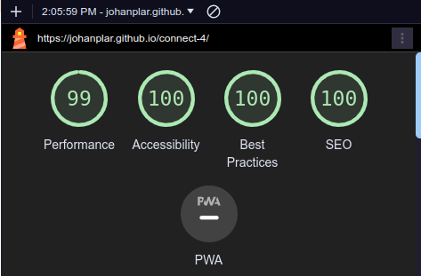

---

# _Connect 4_

The CONNECT 4 website is an interactive two player game for entertainment purposes. It has an intuitive and responsive design which allows the user to compete against a friend or foe in the classic batle to be the first to connect for colored discs in a row.
The site can be accessed by this [link](https://johanplar.github.io/connect-4/)

---

## User Stories

### First Time Visitor Goals:

- As a First Time Visitor, I want to easily understand the main purpose of the site, so I can learn more about the game application.
- As a First Time Visitor, I want to be able to easily navigate through the website, so I can find the content.
- As a First Time Visitor, I want to quickly acces the game so I can start playing.

### Returning Visitor Goals:

- As a Returning Visitor, I want to continue to play and so I can set higher scores against my opponent.

### Frequent Visitor Goals:

- As i Frequent Visitor I want to continue practicing so I'll become a seasoned CONNECT 4 master.

## Features

- ### Logo Bar

- #### Logo
  
- ### Main Menu

- #### Main Menu Buttons

  - Positioned at the center of the page for clear visibility.
  - Two buttons let's the user to choose either to start the game or to read the rules of the game.

    

- ##### Start Button

  - By clicking the Start Button the Game Area is being shown and the Main Menu is hidden. No redirection of URL:s are being used instead the stylesheet is being manipulated by the script.js file.

- ##### Rules Button

  - By clicking the Rules button the user will access CONNECT 4- list of rules placed on top of the rules modal. A span with a closing x is being used to allow the user to return to the Main Menu.

- ###### Rules Modal

  - Displays The Connect 4 Rules list which explains the Game. The X-span in the top left corner closes the Modal and the Main Menu will reappear.
    

  ***

- ### Home Page

  - Represent:

    - A simple yet enjoyable game experience.
    - Clean game mechanics to allow an intuitive interaction.
    - Automatically Checks who's is winning and keeps track of the score.

  

- #### Game Board

  - Seven columns and six rows shows the slots where the users can drop their game coins. Placed on top under the Logo.
    

- #### Game Buttons area

  - Contains three buttons which lets the user Reset the Board, Reset the Score and Quit the Game.
    

- #### Players Area

  - Shows which players turn is next. Controlled in the script.js file.
  - Shows the score between the players also controlled in the script.js.

  

- #### After Win Menu

  - Shows who won or if the game is a draw.

  

  - ##### After Win Menu buttons
    - Allows the user to either continue in a new round or quit the game.

  ***

- #### Footer

  - Footer contains an author copyright declaration.

  

---

## Technologies Used

- [HTML](https://developer.mozilla.org/en-US/docs/Web/HTML) was used as the foundation of the site.
- [CSS](https://developer.mozilla.org/en-US/docs/Web/css) - was used to add the styles and layout of the site.
- [CSS Flexbox](https://developer.mozilla.org/en-US/docs/Web/CSS/CSS_flexible_box_layout) - was used to arrange items symetrically on the pages.
- [CSS roots](https://developer.mozilla.org/en-US/docs/Web/CSS/:root) - was used to declaring global CSS variables and apply them throughout the project.
- [JavaScript](https://developer.mozilla.org/en-US/docs/Web/javascript) - w as used to create the game logic, and to operate the users interaction with the page.
- [Balsamiq](https://balsamiq.com/) was used to make wireframes for the website.
- [Visual Studio Code](https://code.visualstudio.com/) was used as the main tool to write and edit code.
- [Git](https://git-scm.com/) was used for the version control of the website.
- [GitHub](https://github.com/) was used to host the code of the website.
- [Website Mockup Generator](https://websitemockupgenerator.com/) Was used to create the responsive Mockup png for Readme file visualisation.
- [ezgif](https://ezgif.com/) Was used to create gif animations for Readme file visualisation.

---

## Design

### Color Scheme

- Champagne/Bisque was used as the background color for the logo bar .

- Coral was used as a border color for the buttons.

- Blue/Yellow/Red was used as the game board colors to mimic the physical world original game of Connect 4.

### Typography

- Chakra Petch was chosen as the primary font for it's classic arcade game resemblence.

### Wireframes

#### Main Menu

- [Main Menu.](documentation/main-menu-display.png)

#### Rules

- [Home Page. Tablet Screen](documentation/rules-display.png)

#### The Game

- [Home Page. Desktop Screen](documentation/the-game-display.png)

#### Winner

- [Home Page. Desktop Screen](documentation/winner-display.png)

---

## Testing

In order to confirm the correct functionality, responsiveness, and appearance:

- The website was tested on the following browsers: Chrome, Firefox, Edge.

  - Chrome:

  

  - FireFox:

  

  - Edge:

  

- The website was checked by devtools implemented in Edge and Chrome browsers.

* The website was checked with [Responsive Website Design Tester](https://responsivedesignchecker.com/).

  - Desktop Screen:
    

  - Tablet Screen:
    

  - Mobile Screen:

  

- The functionality of the links in the website was checked as well by different users.

### Manual testing

| feature            | action                          | expected result                               | tested | passed | comments |
| ------------------ | ------------------------------- | --------------------------------------------- | ------ | ------ | -------- |
| Main Menu          |                                 |                                               |        |        |          |
| Start Game         | Click on the Start Game Button  | The Main Menu is blocked and Game appear      | Yes    | Yes    | -        |
| Rules              | Click on Rules Button           | The Rules list is displayed                   | Yes    | Yes    | -        |
| The Game           |                                 |                                               |        |        |          |
| Game Board         | Click on a column in the board  | Red or yellow coin placed at bottom of column | Yes    | Yes    | -        |
| Reset Board Button | Click on the Reset Board Button | The board is cleared of all coins             | Yes    | Yes    | -        |
| Reset Score Button | Click on the Reset Score Button | The scores are set to zero                    | Yes    | Yes    | -        |
| Quit Game Button   | Click on the Quit Game Button   | Exits the Game and Opens the Main Menu        | Yes    | Yes    | -        |

### Flowchart

-

### JavaScript diagram

-

### Bugs

1. Game turn logic issue when turn counter was used to calculate draw.

- Solution - Game turn logic was changed so that the turn was set by calculating the objects in the GameArray.

2. Game turn logic forced every new round to be started by player 1.

- Solution - chooseColumn was changed to check the background color property of #p1-turn span instead of odd or even turns.

3. The check winner algo had uneccessary combinations initially.

- Solution - Check winner algo was reduced to cover only 5 options instead of previously 7.

- #### Unsolved bugs
  - None.

---

## Validator testing

- ### HTML

  #### Home Page

  - No errors or warnings were found when passing through the official W3C validator.

  

- ### CSS

  No errors or warnings were found when passing through the official W3C (Jigsaw) validator.
  

  - ### Accessibility and performance
    - Using lighthouse in devtools I confirmed that the website is performing well, accessible and colors and fonts chosen are readable.

  #### Home page

  

---

## Deployment

- The site was deployed to GitHub pages. The steps to deploy are as follows:
  - In the [GitHub repository](https://github.com/joahnplar/connect-4), navigate to the Settings tab and then choose pages in the left panel.
  - From the source section drop-down menu, select the **Main** Branch, then click "Save".
  - The page will be automatically refreshed with a detailed ribbon display to indicate the successful deployment.

The live link can be found [here](https://johanplar.github.io/connect-4)

## Local Deployment

In order to make a local copy of this project, you can clone it.
In your IDE Terminal, type the following command to clone my repository:

- `git clone https://github.com/johanplar/connect-4.git`

- Alternatively, if you use Gitpod, you can [click here](https://gitpod.io/#https://github.com/johanplar/connect-4), which will start the Gitpod workspace for you.

## Future improvements

- Add play against computer option

## Media

- Google Fonts
- Favicon

## Tools

- [EzGif](https://ezgif.com) was used to resize GIF images.
- [cooler](https://coolors.co/) was used to create the color palette.
- [mockupGen](https://websitemockupgenerator.com/) was used for responsive mockup png.
- [image optimizer](http://www.imageoptimizer.net/) was used to resize images.
- [Miro](http://www.miro.com/) for flowchart creation.

## Acknowledgments

- [Code Institute](https://codeinstitute.net/) For the Code Institute course material in html and CSS and for the Slack community members for their support and help.
- [Kevin Powell](https://www.youtube.com/user/KepowOb) for his CSS tutorials in general and more specifically for the hamburger code.
- [Aleksei Konovalov](https://github.com/lexach91) my Code Institue tutor who inspired me to push myself further.
